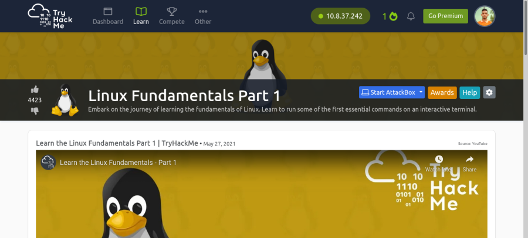

**<h1>Task 1:</h1>**

<h3>Q: Let's get started!</h3>

### A: `No answer need`
 

**<h1>Task 2:</h1>**

<h3>Q: Research: What year was the first release of a Linux operating system?</h3>
 

search the question in [google](https://www.google.com)
 

 

### A: `1991` 
 

**<h1>Task 3:</h1>**

<h3>Q: I've deployed my first Linux machine!</h3>

### A: `No answer need`
 

**<h1>Task 4:</h1>**

### Q: If we wanted to output the text `"TryHackMe"`, what would our command be?

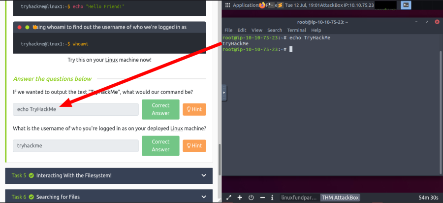

### A: `echo TryHackMe`

### Q: What is the username of who you're logged in as on your deployed Linux machine?

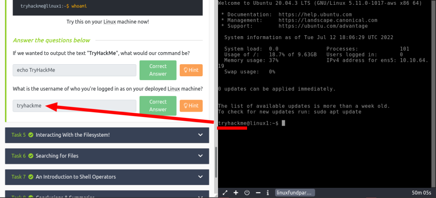

### A: `tryhackme`
 

**<h1>Task 5:</h1>**

### Q: On the Linux machine that you deploy, how many folders are there?

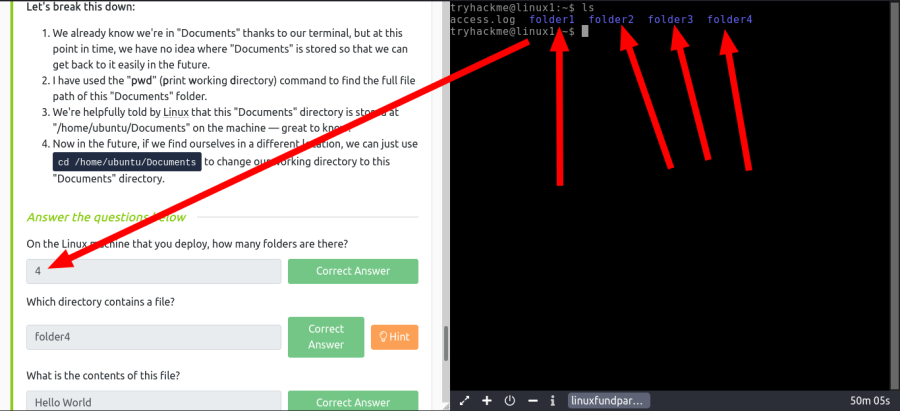

### A: `4`

### Q: Which directory contains a file?

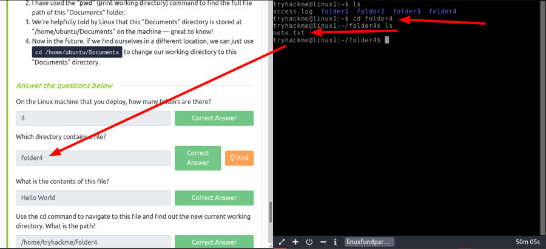

### A: `folder4`

### Q: What is the contents of this file?

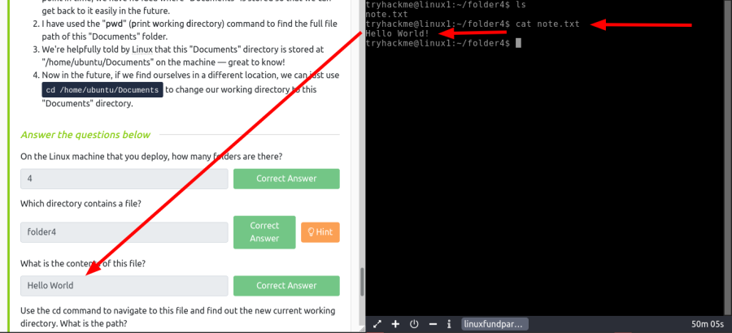

### A: `Hello World`

### Q: Use the cd command to navigate to this file and find out the new current working directory. What is the path?

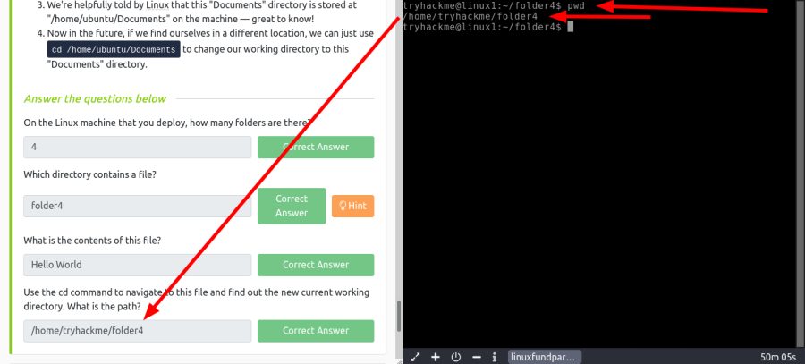

### A: `/home/tryhackme/folder4`
 

**<h1>Task 6:</h1>**

### Q: Use grep on `"access.log"` to find the flag that has a prefix of `"THM"`. What is the flag?

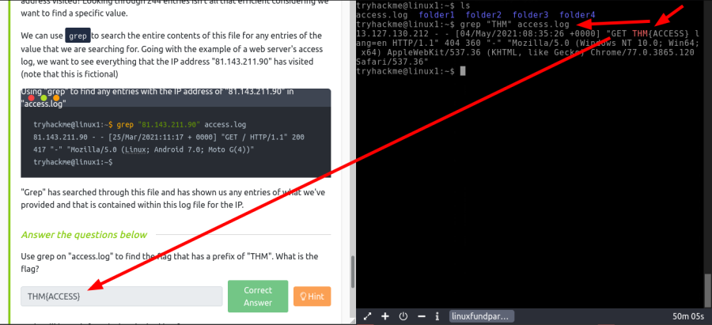

    grep "THM" access.log

### A: `THM{ACCESS}`

### Q: And I still haven't found what I'm looking for!

### A: No Answer need
 

**<h1>Task 7:</h1>**

### Q: If we wanted to run a command in the background, what operator would we want to use?

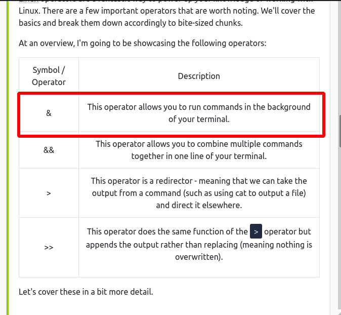

### A: `&`

### Q: If I wanted to replace the contents of a file named `"passwords"` with the word `"password123"`, what would my command be?

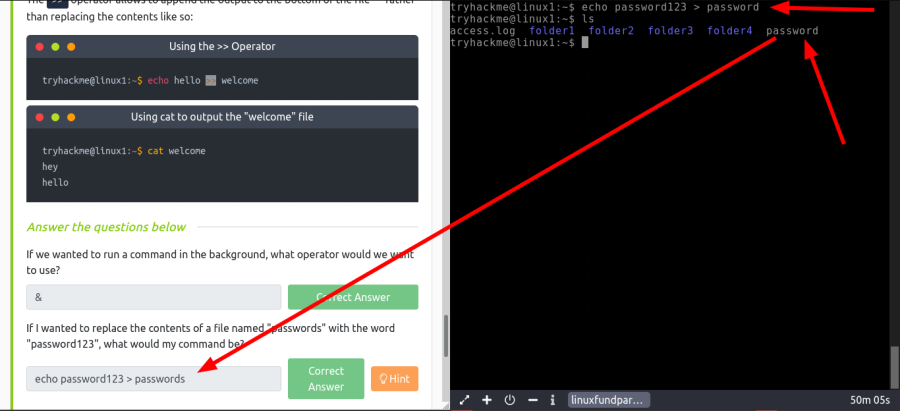

### A: `echo password123 > passwords`

### Q: Now if I wanted to add `"tryhackme"` to this file named `"passwords"` but also keep `"passwords123"`, what would my command be

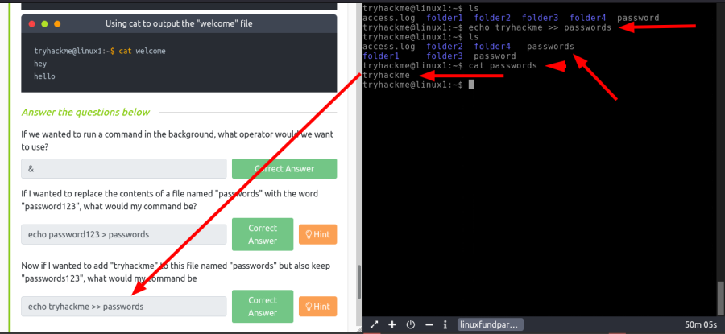

### A: `echo tryhackme >> passwords`

### Q: Now use the deployed Linux machine to put these into practice

### A: No answer need
 

**<h1>Task 8:</h1>**

### Q: I'll have a play around!

### A: No answer need
 

**<h1>Task 9:</h1>**

### Q: Terminate the machine deployed in this room from task 3.

### A: No answer need

### Q: Join  [Linux Fundamentals Part 2](https://tryhackme.com/jr/linuxfundamentalspart2)!

### A: No answer need