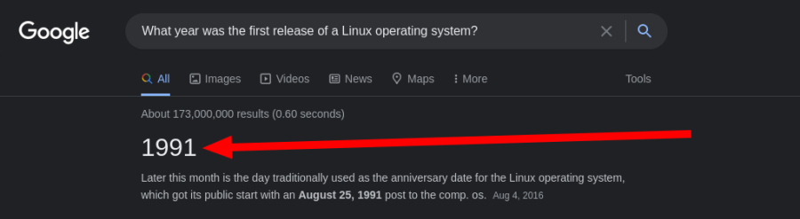

**<h1>Task 1:</h1>**

<h3>Q: Let's get started!</h3>

### A: `No answer need`
 

**<h1>Task 2:</h1>**

<h3>Q: Research: What year was the first release of a Linux operating system?</h3>
 

search the question in [google](https://www.google.com)
 

 

### A: `1991` 
 

**<h1>Task 3:</h1>**

<h3>Q: I've deployed my first Linux machine!</h3>

### A: `No answer need`
 

**<h1>Task 4:</h1>**

### Q: If we wanted to output the text `"TryHackMe"`, what would our command be?

### A: `echo TryHackMe`

### Q: What is the username of who you're logged in as on your deployed Linux machine?

### A: `tryhackme`
 

**<h1>Task 5:</h1>**

### Q: On the Linux machine that you deploy, how many folders are there?

### A: `4`

### Q: Which directory contains a file?

### A: `folder4`